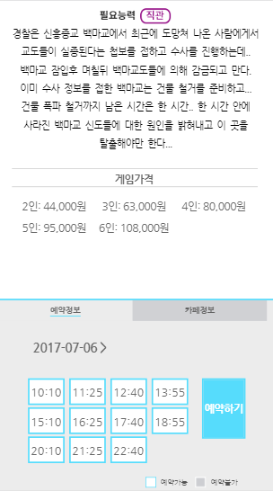
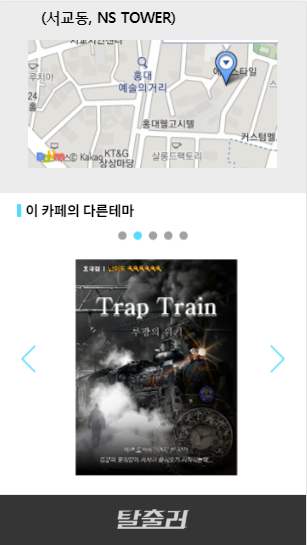

## Talchuler

# Introduction
> Talchuler is an O2O platform. 
- We give connections between Offline Escaping cafes and game players(customers) at cafes. 
- We help cafe owners thereby promoting thier cafes and making reservation.

# What is Escaping cafe?
> It's like a game in a room.
- You can go inside a room with your friends.
- You must find hints to escape the room in time. 
- It has a lot of themes such as horror, friendship, intelligence and so on.

# How to use?
> Are you player? or owner?
- We give different service to players and owners.
- You'll be able to know if you join our site.

# Screen Shot
 
 
 

# links
- Site
 http://www.talchuler.com
-Android
 preparing
-IOS 
 preparing
